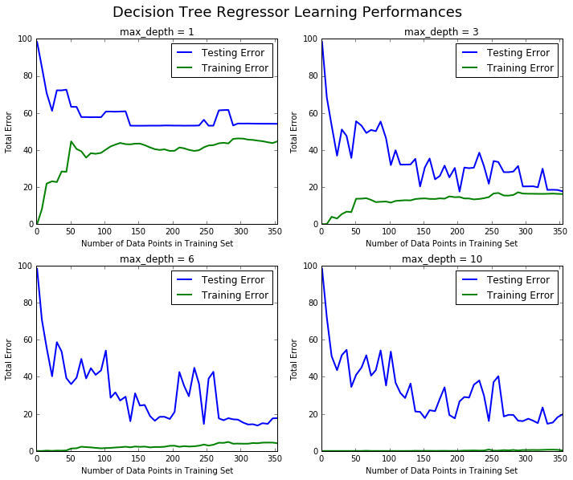
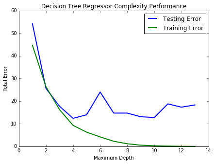

# Machine Learning Engineer Nanodegree
## Model Evaluation & Validation
## Project 1: Predicting Boston Housing Prices

Welcome to the first project of the Machine Learning Engineer Nanodegree! In this notebook, some template code has already been written. You will need to implement additional functionality to successfully answer all of the questions for this project. Unless it is requested, do not modify any of the code that has already been included. In this template code, there are four sections which you must complete to successfully produce a prediction with your model. Each section where you will write code is preceded by a **STEP X** header with comments describing what must be done. Please read the instructions carefully!

In addition to implementing code, there will be questions that you must answer that relate to the project and your implementation. Each section where you will answer a question is preceded by a **QUESTION X** header. Be sure that you have carefully read each question and provide thorough answers in the text boxes that begin with "**Answer:**". Your project submission will be evaluated based on your answers to each of the questions.  

A description of the dataset can be found [here](https://archive.ics.uci.edu/ml/datasets/Housing), which is provided by the **UCI Machine Learning Repository**.

# Getting Started
To familiarize yourself with an iPython Notebook, **try double clicking on this cell**. You will notice that the text changes so that all the formatting is removed. This allows you to make edits to the block of text you see here. This block of text (and mostly anything that's not code) is written using [Markdown](http://daringfireball.net/projects/markdown/syntax), which is a way to format text using headers, links, italics, and many other options! Whether you're editing a Markdown text block or a code block (like the one below), you can use the keyboard shortcut **Shift + Enter** or **Shift + Return** to execute the code or text block. In this case, it will show the formatted text.

Let's start by setting up some code we will need to get the rest of the project up and running. Use the keyboard shortcut mentioned above on the following code block to execute it. Alternatively, depending on your iPython Notebook program, you can press the **Play** button in the hotbar. You'll know the code block executes successfully if the message *"Boston Housing dataset loaded successfully!"* is printed.


```python
# Importing a few necessary libraries
import numpy as np
import matplotlib.pyplot as pl
from sklearn import datasets
from sklearn.tree import DecisionTreeRegressor

# Make matplotlib show our plots inline (nicely formatted in the notebook)
%matplotlib inline

# Create our client's feature set for which we will be predicting a selling price
CLIENT_FEATURES = [[11.95, 0.00, 18.100, 0, 0.6590, 5.6090, 90.00, 1.385, 24, 680.0, 20.20, 332.09, 12.13]]


# Load the Boston Housing dataset into the city_data variable
city_data = datasets.load_boston()

# Initialize the housing prices and housing features
housing_prices = city_data.target
housing_features = city_data.data


meanss = np.mean(housing_features, axis = 0)
print meanss.astype(int)

    
print "Boston Housing dataset loaded successfully!"
```

    [  3  11  11   0   0   6  68   3   9 408  18 356  12]
    Boston Housing dataset loaded successfully!
    

# Statistical Analysis and Data Exploration
In this first section of the project, you will quickly investigate a few basic statistics about the dataset you are working with. In addition, you'll look at the client's feature set in `CLIENT_FEATURES` and see how this particular sample relates to the features of the dataset. Familiarizing yourself with the data through an explorative process is a fundamental practice to help you better understand your results.

## Step 1
In the code block below, use the imported `numpy` library to calculate the requested statistics. You will need to replace each `None` you find with the appropriate `numpy` coding for the proper statistic to be printed. Be sure to execute the code block each time to test if your implementation is working successfully. The print statements will show the statistics you calculate!


```python
# Number of houses in the dataset
total_houses   = np.count_nonzero(housing_prices)

# Number of features in the dataset
total_features = city_data.data.shape[1]

# Minimum housing value in the dataset
minimum_price  = np.amin(city_data.target)

# Maximum housing value in the dataset
maximum_price  = np.amax(city_data.target)

# Mean house value of the dataset
mean_price     = np.average(city_data.target)

# Median house value of the dataset
median_price   = np.median(city_data.target)

# Standard deviation of housing values of the dataset
std_dev        = np.std(city_data.target)

# Show the calculated statistics
print "Boston Housing dataset statistics (in $1000's):\n"
print "Total number of houses:", total_houses
print "Total number of features:", total_features
print "Minimum house price:", minimum_price
print "Maximum house price:", maximum_price
print "Mean house price: {0:.3f}".format(mean_price)
print "Median house price:", median_price
print "Standard deviation of house price: {0:.3f}".format(std_dev)
```

    Boston Housing dataset statistics (in $1000's):
    
    Total number of houses: 506
    Total number of features: 13
    Minimum house price: 5.0
    Maximum house price: 50.0
    Mean house price: 22.533
    Median house price: 21.2
    Standard deviation of house price: 9.188
    


```python
print CLIENT_FEATURES
```

    [[11.95, 0.0, 18.1, 0, 0.659, 5.609, 90.0, 1.385, 24, 680.0, 20.2, 332.09, 12.13]]
    

# Evaluating Model Performance
In this second section of the project, you will begin to develop the tools necessary for a model to make a prediction. Being able to accurately evaluate each model's performance through the use of these tools helps to greatly reinforce the confidence in your predictions.

## Step 2
In the code block below, you will need to implement code so that the `shuffle_split_data` function does the following:
- Randomly shuffle the input data `X` and target labels (housing values) `y`.
- Split the data into training and testing subsets, holding 30% of the data for testing.

If you use any functions not already acessible from the imported libraries above, remember to include your import statement below as well!   
Ensure that you have executed the code block once you are done. You'll know the `shuffle_split_data` function is working if the statement *"Successfully shuffled and split the data!"* is printed.


```python
# Put any import statements you need for this code block here
import sklearn.metrics as sk


def shuffle_split_data(X, y):
    """ Shuffles and splits data into 70% training and 30% testing subsets,
        then returns the training and testing subsets. """

    # Shuffle and split the data

    X_train, X_test, y_train, y_test = cv.train_test_split(X, y, test_size=0.30, random_state=1)

    # Return the training and testing data subsets
    return X_train, y_train, X_test, y_test


# Test shuffle_split_data
try:
    X_train, y_train, X_test, y_test = shuffle_split_data(housing_features, housing_prices)
    print "Successfully shuffled and split the data!"
except:
    print "Something went wrong with shuffling and splitting the data."
```

    Successfully shuffled and split the data!
    

## Step 3
In the code block below, you will need to implement code so that the `performance_metric` function does the following:
- Perform a total error calculation between the true values of the `y` labels `y_true` and the predicted values of the `y` labels `y_predict`.

You will need to first choose an appropriate performance metric for this problem. See [the sklearn metrics documentation](http://scikit-learn.org/stable/modules/classes.html#sklearn-metrics-metrics) to view a list of available metric functions. **Hint: ** Look at the question below to see a list of the metrics that were covered in the supporting course for this project.

Once you have determined which metric you will use, remember to include the necessary import statement as well!  
Ensure that you have executed the code block once you are done. You'll know the `performance_metric` function is working if the statement *"Successfully performed a metric calculation!"* is printed.


```python
# Put any import statements you need for this code block here
import sklearn.metrics as sk


def performance_metric(y_true, y_predict):
    """ Calculates and returns the total error between true and predicted values
        based on a performance metric chosen by the student. """

    error = sk.mean_squared_error(y_true, y_predict)
    print error
    return error


# Test performance_metric
try:
    total_error = performance_metric(y_train, y_train)
    print "Successfully performed a metric calculation!"
except:
    print "Something went wrong with performing a metric calculation."
```

    0.0
    Successfully performed a metric calculation!
    

## Step 4 (Final Step)
In the code block below, you will need to implement code so that the `fit_model` function does the following:
- Create a scoring function using the same performance metric as in **Step 2**. See the [sklearn `make_scorer` documentation](http://scikit-learn.org/stable/modules/generated/sklearn.metrics.make_scorer.html).
- Build a GridSearchCV object using `regressor`, `parameters`, and `scoring_function`. See the [sklearn documentation on GridSearchCV](http://scikit-learn.org/stable/modules/generated/sklearn.grid_search.GridSearchCV.html).

When building the scoring function and GridSearchCV object, *be sure that you read the parameters documentation thoroughly.* It is not always the case that a default parameter for a function is the appropriate setting for the problem you are working on.

Since you are using `sklearn` functions, remember to include the necessary import statements below as well!  
Ensure that you have executed the code block once you are done. You'll know the `fit_model` function is working if the statement *"Successfully fit a model to the data!"* is printed.


```python
# Put any import statements you need for this code block
from sklearn import grid_search as gs
from sklearn import metrics as m


def fit_model(X, y):
    """ Tunes a decision tree regressor model using GridSearchCV on the input data X 
        and target labels y and returns this optimal model. """

    # Create a decision tree regressor object
    regressor = DecisionTreeRegressor()

    # Set up the parameters we wish to tune
    parameters = {'max_depth':(1,2,3,4,5,6,7,8,9,10)}

    # Make an appropriate scoring function
    scoring_function = m.make_scorer(m.mean_squared_error, greater_is_better = False)

    # Make the GridSearchCV object
    reg = gs.GridSearchCV(regressor,parameters, scoring=scoring_function)

    # Fit the learner to the data to obtain the optimal model with tuned parameters
    reg.fit(X, y)

    # Return the optimal model
    return reg.best_estimator_


# Test fit_model on entire dataset
try:
    reg = fit_model(housing_features, housing_prices)
    print "Successfully fit a model!"
except:
    print "Something went wrong with fitting a model."
```

    Successfully fit a model!
    

# Checkpoint!
You have now successfully completed your last code implementation section. Pat yourself on the back! All of your functions written above will be executed in the remaining sections below, and questions will be asked about various results for you to analyze. To prepare the **Analysis** and **Prediction** sections, you will need to intialize the two functions below. Remember, there's no need to implement any more code, so sit back and execute the code blocks! Some code comments are provided if you find yourself interested in the functionality.


```python
def learning_curves(X_train, y_train, X_test, y_test):
    """ Calculates the performance of several models with varying sizes of training data.
        The learning and testing error rates for each model are then plotted. """
    
    print "Creating learning curve graphs for max_depths of 1, 3, 6, and 10. . ."
    
    # Create the figure window
    fig = pl.figure(figsize=(10,8))

    # We will vary the training set size so that we have 50 different sizes
    sizes = np.rint(np.linspace(1, len(X_train), 50)).astype(int)
    train_err = np.zeros(len(sizes))
    test_err = np.zeros(len(sizes))

    # Create four different models based on max_depth
    for k, depth in enumerate([1,3,6,10]):
        
        for i, s in enumerate(sizes):
            
            # Setup a decision tree regressor so that it learns a tree with max_depth = depth
            regressor = DecisionTreeRegressor(max_depth = depth)
            
            # Fit the learner to the training data
            regressor.fit(X_train[:s], y_train[:s])

            # Find the performance on the training set
            train_err[i] = performance_metric(y_train[:s], regressor.predict(X_train[:s]))
            
            # Find the performance on the testing set
            test_err[i] = performance_metric(y_test, regressor.predict(X_test))

        # Subplot the learning curve graph
        ax = fig.add_subplot(2, 2, k+1)
        ax.plot(sizes, test_err, lw = 2, label = 'Testing Error')
        ax.plot(sizes, train_err, lw = 2, label = 'Training Error')
        ax.legend()
        ax.set_title('max_depth = %s'%(depth))
        ax.set_xlabel('Number of Data Points in Training Set')
        ax.set_ylabel('Total Error')
        ax.set_xlim([0, len(X_train)])
    
    # Visual aesthetics
    fig.suptitle('Decision Tree Regressor Learning Performances', fontsize=18, y=1.03)
    fig.tight_layout()
    fig.show()
```


```python
def model_complexity(X_train, y_train, X_test, y_test):
    """ Calculates the performance of the model as model complexity increases.
        The learning and testing errors rates are then plotted. """
    
    print "Creating a model complexity graph. . . "

    # We will vary the max_depth of a decision tree model from 1 to 14
    max_depth = np.arange(1, 14)
    train_err = np.zeros(len(max_depth))
    test_err = np.zeros(len(max_depth))

    for i, d in enumerate(max_depth):
        # Setup a Decision Tree Regressor so that it learns a tree with depth d
        regressor = DecisionTreeRegressor(max_depth = d)

        # Fit the learner to the training data
        regressor.fit(X_train, y_train)

        # Find the performance on the training set
        train_err[i] = performance_metric(y_train, regressor.predict(X_train))

        # Find the performance on the testing set
        test_err[i] = performance_metric(y_test, regressor.predict(X_test))

    # Plot the model complexity graph
    pl.figure(figsize=(7, 5))
    pl.title('Decision Tree Regressor Complexity Performance')
    pl.plot(max_depth, test_err, lw=2, label = 'Testing Error')
    pl.plot(max_depth, train_err, lw=2, label = 'Training Error')
    pl.legend()
    pl.xlabel('Maximum Depth')
    pl.ylabel('Total Error')
    pl.show()
```

# Analyzing Model Performance
In this third section of the project, you'll take a look at several models' learning and testing error rates on various subsets of training data. Additionally, you'll investigate one particular algorithm with an increasing `max_depth` parameter on the full training set to observe how model complexity affects learning and testing errors. Graphing your model's performance based on varying criteria can be beneficial in the analysis process, such as visualizing behavior that may not have been apparent from the results alone.


```python
learning_curves(X_train, y_train, X_test, y_test)
```

    Creating learning curve graphs for max_depths of 1, 3, 6, and 10. . .
    0.0
    98.3224342105
    8.03729166667
    84.7365497076
    21.8544761905
    70.7667991407
    23.1092339545
    61.1647255042
    22.6923214286
    72.2093682029
    28.4026718147
    72.1955344791
    28.2421861472
    72.5744462346
    44.6502208014
    63.3395175803
    40.5614915254
    63.259452924
    39.2708912072
    57.7902117413
    35.883516116
    57.7762710498
    38.3001368243
    57.7035356075
    37.9522341045
    57.7507873792
    38.463155418
    57.719004389
    40.2347602827
    60.748646112
    41.9236826629
    60.7703621456
    42.9111832252
    60.6826006721
    43.8054770249
    60.7831630425
    43.1595830153
    60.8720775391
    43.0599659974
    53.1418584726
    43.4140491641
    53.1057795338
    43.4483012342
    53.1070069404
    42.6289119167
    53.1125756047
    41.3856158326
    53.1541356251
    40.4582730389
    53.1481182331
    40.0343493947
    53.1558947019
    40.3570943276
    53.235242432
    39.5149471983
    53.2333562489
    39.5835361386
    53.1771623394
    41.3269090732
    53.1803770546
    40.9301296962
    53.1292070883
    40.0715566388
    53.1591725519
    39.5024007757
    53.1584572394
    39.8995693132
    53.2390284667
    41.4494614244
    56.3215869365
    42.4568140801
    53.1363012498
    42.6158107737
    53.1407116045
    43.603990571
    61.3851039297
    43.9062506887
    61.5535811162
    43.5387623694
    61.6326675225
    45.9954481628
    53.2497946861
    46.2489900056
    54.298310604
    46.1315919384
    54.2687661071
    45.6047181481
    54.2967786594
    45.4273819329
    54.2445341495
    45.0757477846
    54.2064264255
    44.7618472132
    54.1817392761
    44.1806192316
    54.1813454764
    43.7395408424
    54.158010876
    44.6808032477
    54.1464733818
    0.0
    98.3224342105
    0.0408333333333
    68.2269444444
    3.92893333333
    53.3334151316
    3.04708074534
    36.9376597744
    5.41435858586
    51.0740121384
    6.7191722973
    47.583228053
    6.51004786574
    35.7275264831
    13.6877615025
    55.5049990213
    13.7464381759
    53.1191352684
    13.9670885616
    49.1969397666
    13.0815586653
    50.8334470821
    11.8691444619
    50.1435293555
    12.0661845592
    55.3630977196
    12.1875604056
    46.2803445276
    11.6109034462
    31.8636033596
    12.5039310713
    39.8654795001
    12.7122574507
    32.1163912225
    12.8821424261
    32.1125912577
    12.8089975446
    32.229188181
    13.5322835184
    35.2391783407
    13.7745841406
    20.3456602448
    13.8868690798
    30.6148372348
    13.6064269329
    35.4010598535
    13.5646338121
    24.18663113
    13.894445682
    25.9845459925
    13.7359754059
    31.5642190526
    14.9550107394
    25.2487469515
    14.5396325714
    30.3220325687
    14.6305643324
    17.5648429739
    13.8556368775
    30.5339075705
    13.8225033561
    30.1822861116
    13.3452279804
    30.4653851761
    13.5883473774
    38.5614451146
    13.9898833943
    31.1383744437
    14.5982279202
    21.7764731065
    16.5294474737
    34.0557909535
    16.8083988203
    33.490565682
    15.4298847992
    28.0459242963
    15.3837370723
    28.0346409386
    15.7292320446
    28.3684674445
    17.1916893553
    31.3718417546
    16.4855634005
    20.3306116827
    16.3913024833
    20.3691110774
    16.3852216826
    20.4160943402
    16.3346453093
    19.858015733
    16.3113045147
    29.9194260175
    16.3626727765
    18.465570053
    16.4829684442
    18.5342407562
    16.3198363958
    18.4278005684
    16.2582331003
    17.7389846107
    0.0
    98.3224342105
    0.0
    70.8125657895
    0.195666666667
    55.7856414474
    0.0428260869565
    40.3136513158
    0.196166666667
    58.7248848684
    0.148423423423
    53.6934548246
    0.270691287879
    39.3068799114
    1.29988795518
    36.0620150525
    1.46389612224
    39.549739162
    2.27667846043
    49.6865598821
    2.06449543379
    39.1518122076
    1.92385885989
    44.6703657398
    1.66134619595
    41.0911235164
    1.41869014202
    43.4873844461
    1.57256325864
    54.2097493317
    1.65615820724
    28.7462713667
    1.8703640952
    31.6028992533
    2.00993407293
    27.2226634162
    2.272193135
    29.2977779144
    1.96465145503
    16.0523597798
    2.38016399463
    31.1034867447
    2.20798149256
    24.4936258125
    2.35001996682
    24.8354799432
    1.91358477281
    18.7876283968
    2.13292091873
    16.2880367674
    2.11802174268
    18.4201935598
    2.25318927196
    18.4436391621
    2.77362099352
    17.2561625935
    2.80872589473
    21.0618284788
    2.25119066952
    42.5882574377
    2.58237463059
    35.115248053
    2.3840490892
    29.5490680159
    2.50914761554
    44.8752948743
    2.83779570347
    36.1138682343
    3.43780105213
    14.6075223764
    2.89123768693
    39.0402507196
    3.3488545263
    42.7279214979
    4.4265031763
    17.592542811
    4.35180409384
    16.5715008199
    4.85812521382
    17.6917176102
    3.9023296193
    17.0758817219
    3.97308641554
    16.9019198956
    3.90460727621
    15.2659839188
    3.92033350785
    14.2757839242
    4.26613575608
    14.4173673409
    4.16392459984
    13.7221119365
    4.47275252777
    14.9743426279
    4.52712812522
    14.6423274622
    4.50496606448
    17.5646611531
    4.17594595812
    17.7323013399
    0.0
    98.3224342105
    0.0
    71.93875
    0.0
    51.2001315789
    0.0
    43.5972368421
    0.000166666666667
    51.7109375
    0.0
    54.5478947368
    0.0
    34.5734868421
    0.00254901960784
    41.0729440789
    0.00135593220339
    45.0478947368
    0.11253030303
    51.6331625
    0.00414383561644
    40.6502919408
    0.00640625
    43.6283347039
    0.000229885057471
    54.2674342105
    0.000105263157895
    35.3494901316
    0.00625816993464
    53.6336494883
    0.00100917431193
    36.7789638158
    0.00113505747126
    31.3443932749
    0.00172086720867
    28.5729532164
    0.00284987277354
    36.367496345
    0.089568236715
    21.3009730217
    0.0479574712644
    21.0888025219
    0.0524013157895
    17.7408589181
    0.0634538784067
    21.9837385782
    0.0291846307385
    21.4777271382
    0.054263136289
    28.1703556342
    0.0815290055249
    34.347978591
    0.0346564716312
    19.4157645742
    0.0513183309038
    17.6001812217
    0.0635282078349
    26.7531269043
    0.207280952381
    29.1256206323
    0.209704465657
    28.7894838321
    0.275218501984
    35.7230183845
    0.18351927682
    38.0406700795
    0.244837752903
    29.6979916062
    0.736501244164
    16.1596946558
    0.167498023715
    37.1591429276
    0.173339194139
    40.353371216
    0.439834355882
    18.6022942556
    0.302364688057
    19.4793492437
    0.527624605989
    19.4449607487
    0.253293266326
    16.3200322601
    0.494475349602
    16.1043635589
    0.494324773881
    17.4054929
    0.539951862507
    16.3336069378
    0.488588172021
    15.0300424789
    0.57586548816
    23.4609410282
    0.658826944683
    14.6767697053
    0.688857930505
    15.3383656766
    0.622001952418
    18.2203175257
    0.256793181708
    19.6571659013
    

    C:\Anaconda2\lib\site-packages\matplotlib\figure.py:397: UserWarning: matplotlib is currently using a non-GUI backend, so cannot show the figure
      "matplotlib is currently using a non-GUI backend, "
    





```python
model_complexity(X_train, y_train, X_test, y_test)
```

    Creating a model complexity graph. . . 
    44.6808032477
    54.1464733818
    26.3461372216
    25.6217609916
    16.2582331003
    17.7389846107
    9.2767538123
    12.4018317397
    6.29491207432
    13.9744288629
    4.17594595812
    24.0282388399
    2.26401885362
    14.7159087919
    1.16963407345
    14.7168338191
    0.536368134455
    13.0899681915
    0.256793181708
    12.7743317253
    0.119861803059
    18.7824213075
    0.0359806967985
    17.3337794408
    0.00532519504977
    18.3072154717
    





# Model Prediction
In this final section of the project, you will make a prediction on the client's feature set using an optimized model from `fit_model`. When applying grid search along with cross-validation to optimize your model, it would typically be performed and validated on a training set and subsequently evaluated on a **dedicated test set**. In this project, the optimization below is performed on the *entire dataset* (as opposed to the training set you made above) due to the many outliers in the data. Using the entire dataset for training provides for a less volatile prediction at the expense of not testing your model's performance. 

*To answer the following questions, it is recommended that you run the code blocks several times and use the median or mean value of the results.*


```python


x = []
for i in range(1000):
    x.append(reg.get_params()['max_depth'])
    
print "Final model has an optimal max_depth parameter of", int(np.mean(x))
```

     Final model has an optimal max_depth parameter of 4
    


```python
sale_price = reg.predict(CLIENT_FEATURES)
print "Predicted value of client's home: {0:.3f}".format(sale_price[0])
```

    Predicted value of client's home: 21.630
    
